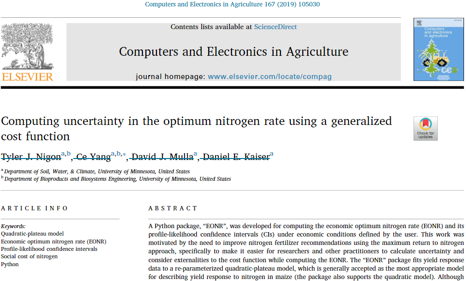

===================
EONR Documentation
===================

*A Python tool for computing the optimum nitrogen rate and its confidence intervals from agricultural research data*

.. |version_current| replace:: 0.2.1
Current version: |version_current|

``EONR`` uses data from agronomic field trials to calculate the EONR under economic conditions defined by the user (i.e., grain price and fertilizer cost).

**Check out the publication** in `Computers and Electronics in Agriculture <https://www.sciencedirect.com/science/article/pii/S0168169919309354>`_:

**Citation:**

Nigon, T., Yang, C., Mulla, D.J., and Kaiser, D.E. (2019). Computing uncertainty in the optimum nitrogen rate using a generalized cost function. *Computers and Electronics in Agriculture*, 167(2019). doi: `10.1016/j.compag.2019.105030 <https://www.sciencedirect.com/science/article/pii/S0168169919309354>`_.

##################
Table of Contents
##################

*Navigate the* **EONR Documentation** *using the* **"Contents"** *dropdown in the Navigation Bar*

.. toctree::
   :maxdepth: 1
   :numbered:
   :titlesonly:

   Home <index>
   installation.ipynb
   tutorial.ipynb
   advanced_tutorial.ipynb
   background.ipynb
   eonr_api
   license
   changelog

##################
Troubleshooting
##################
Please report any issues you encounter through the `Github issue tracker <https://github.com/tnigon/eonr/issues>`_.

#######
About
#######
``EONR`` is a Python package for computing the economic optimum nitrogen fertilizer rate using data from agronomic field trials under economic conditions defined by the user (i.e., grain price and fertilizer cost).
It can be used for any crop (e.g., corn, wheat, potatoes, etc.), and as of version 0.2.0, both the quadratic-plateau and quadratic models are supported.

**You should always exercise caution in making sure that the model being used is appropriate for your application.**

The methods and algorithms used by the ``EONR`` package are documented in a manuscript published in `Computers and Electronics in Agriculture <https://www.journals.elsevier.com/computers-and-electronics-in-agriculture>`_.

*If there is interest, future versions could add support for other models (spherical, linear-plateau, etc.) that may improve the fit of experimental yield response to nitrogen for various scenarios. Please reach out or contribute to the project if you would like to see support for a particular model.*

Data requirements
******************
The minimum data requirement to utilize this package is observed (or simulated) experimental data of agronomic yield response to nitrogen fertilizer.
In other words, your experiment should have multiple nitrogen rate treatments, and you should have measured the yield for each experimental plot at the end of the season.
Suitable experimental design for your particular experiment is always suggested (e.g., it should probably be replicated).

Intended audience
******************
The intended audiences for this package are agricultural researchers, private sector organizations and consultants that support farmers, and of course those inquisitive farmers that always want to know more about their soils and the environment around them.

Concept of the EONR
********************
The concept behind the *Economic Optimum Nitrogen Rate* approach (also referred to as the *Maximum Return to Nitrogen* approach) is to make the most favorable nitrogen fertilizer recommendation considering three variables:

* Grain price ($ per kg)
* Fertilizer cost ($ per kg)
* Grain yield response to nitrogen fertilizer (modeled from input data)

.. image:: _images/intro_diagram_grey.png
   :width: 1120
   :align: left
   :alt: Corn nitrogen rate response experiment in Minnesota (photo captured in July when the crop is about shoulder-high).

On the left is a corn nitrogen rate response experiment in Minnesota (photo captured in July when the crop is about shoulder-high).
Notice the different shades of green in the crop canopy - the dark, lush green is indicative of sufficient nitrogen availability and the lighter green is indicative of nitrogen stress.
The ``EONR`` Python package was used to compute the economic optimum nitrogen rate (and its 90% confidence intervals) using experimental data, as illustrated in the plot on the right.

For more information about how the economic optimum nitrogen rate is calculated, see the `Background section <background.html>`_.

Motivation for development of ``EONR``
***************************************
Although calculation of the economic optimum nitrogen rate (EONR) from a nitrogen response experiment is a trivial task for agronomic researchers, the computation of its confidence intervals are not.
This is especially true for calculating confidence intervals for data that are explained best with a quadratic-plateau model, which is generally thought of as the most appropriate model for describing yield response to nitrogen in corn.
With the ``EONR`` package available and accessible, I hope all published EONR research also reports the confidence intervals of the maximum likelihood EONR.
Furthermore, I hope this package enables researchers and farmers to take a closer look at evaluating what *the best* nitrogen rate may be.
The EONR considers the cost of nitrogen in addition to the price a farmer receives for their grain. This is great, but this package takes this concept one step further with an added *social cost of nitrogen*.
To consider the environmental or social effect of nitrogen application in agriculture, two things are necessary:

* We have to make it a habit to measure total crop nitrogen uptake (or at least residual soil nitrogen) at the end of the season.
* As a society we have to do a better job of putting a value on the cost of pollution caused by nitrogen fertilizers.

This second point is especially tricky because it is *very subjective* and everyone will have a different opinion.
It's a complex question whose answer changes not only from watershed to watershed, but from household to household, and perhaps even within a household.

Although it is important to recognize that nitrogen probably has some social cost, it is just as important to figure out who pays for that cost. Just remember, farmers farm to produce food and earn a living, they don't farm to pollute the water and air.
Sure, they definitely bear a lot of responsibility in managing their land and their inputs, but that doesn't mean they should also bear all the costs.
If we as a society recognize that pollution caused by nitrogen fertilizer in agriculture is indeed a problem, we should work together to figure out how to support the farmers to help fix the problem (or at least stop it from getting worse).

After all, **farmers farm to grow food, they don't farm to pollute**, *right?*

Acknowledgments
****************

Development of the ``EONR`` package was possible because of financial support from `Minnesota\'s Discovery, Research, and InnoVation Economy <https://mndrive.umn.edu>`_ and the University of Minnesota. The `MnDRIVE Global Food Ventures initiative <https://mndrive.umn.edu/food>`_ and `University of Minnesota Informatics Institute <https://research.umn.edu/units/umii>`_ each provided one year of financial support.

Financial support and other contributions from my graduate advisors, `Dr. David Mulla <https://www.swac.umn.edu/directory/faculty/david-mulla>`_ and `Dr. Ce Yang <https://bbe.umn.edu/directory/faculty/ceyang>`_, were invaluable in the initial development and publication of ``EONR``. `Dr. Daniel Kaiser <https://www.swac.umn.edu/directory/faculty/daniel-kaiser>`_ also played a key role in this project, notably through his efforts in organizing and carrying out many of the field experiments that provided necessary data for this project.

This project is part of a larger project being conducted in fulfillment of my PhD degree in Land and Atmospheric Science. Check out my `personal website <https://tylernigon.me>`_ for an overview of some of my other work.

###################
Indices and tables
###################

* :ref:`genindex`
* :ref:`modindex`
* :ref:`search`
